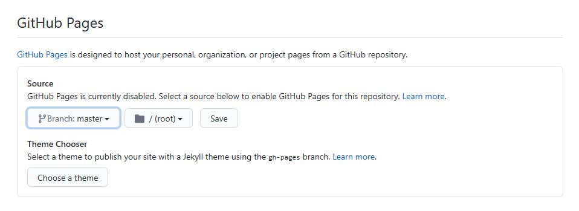

# Hana One-Pick(사회초년생 자산관리서비스)

[프로젝트 홈페이지 - https://koposoftware.github.io/template/](https://koposoftware.github.io/template/)

# 1. 프로젝트 개요

   ## 1) 하나원픽통장(Hana One-Pick)이란?
   
 

      
   - 하나의 통장을 관리 목적에 따라 <strong>__기본금, 생활비, 예비금__</strong></u>으로 분리하여 관리할 수 있는 통장쪼개기 서비스를 제공합니다.
   - 여러개의 실물통장이 필요했던 기존의 통장쪼개기와 다르게 <strong>__하나의 원픽통장을 가입하면 3개의 통장을 사용하는 것__</strong>과 같은 효과가 있습니다.

# 2. 프로젝트 제안서

#### 이미지를 클릭하면 프로젝트 발표자료를 볼 수 있습니다.   
   
  <a href="/Doc/FinalProject_proposal.pdf">발표자료</a>
 

# 3. 프로젝트 결과
프로젝트 결과를 추가하세요. 발표자료. 시연동영상을 추가하세요.

## 발표 ppt 
   [발표자료](/project.pptx) 

## 시연 동영상 

   <iframe id="ytplayer" type="text/html" width="640" height="360" src="https://www.youtube.com/embed/6LxbdIjWP04" frameborder="0"></iframe>

# 4. 본인 소개

본인 소개를 추가하세요

|이름 |고길동||
|연락처 | gdko(@)kopo.ac.kr|
|skill set| Frontend - HTML, CSS, Javascript|
| | Backend - Java, Spring, Oracle|
|자격증|  |
|수상| |
|특기사항|  TOEIC 990 |

# 5. 기타
그외 프로젝트를 더욱 설명할수 있는 것들을 추가하세요

# 홈페이지 설정
 본인 repository에서 "Setting"를 들어가서 GitHub Pages에서 설정 변경.
 <Source>
 Source에서 원하는 branch와 directory 설정한다. 
 기본값은 master 에 root를 설정 
 Save 버튼 꼭 누른다.
 
 <Theme Chooser>
 theme을 변경하여 좀더 이쁜 홈페이지를 만든다.
   
    
   
 
